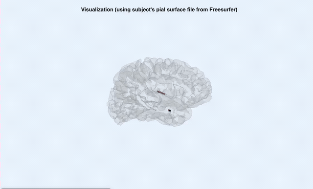

# iEEGLAB

EEGLAB plugin for intracranial EEG (stereo-EEG and ECoG), with a focus on
cortico-cortical evoked potentials (CCEP) from single-pulse electrical
stimulation. Every step runs from the EEGLAB menus or from a script.

<p align="center">
  
  <br>
  <em>sEEG electrodes on the subject's pial surface</em>
</p>

## What it does

| Step | Menu (iEEGLAB >) | Function |
|---|---|---|
| Import a BIDS dataset (MEF3, BrainVision, EDF, .set) | File > Import data > From BIDS folder structure | `pop_importbids` (EEG-BIDS) |
| Electrode coordinates, events and clinician channel labels from the BIDS files | Load electrode coordinates and events | `ieeglab_load` |
| Electrodes on the brain | Visualize electrodes | `ieeglab_vis_elec` |
| Stimulation-artifact blanking, filtering, epoching, trial and channel rejection, baseline | Preprocess iEEG data | `ieeglab_preprocess` |
| Re-referencing: CARLA (CCEP), common average | iEEG re-referencing | `pop_ieeglab_reref` |
| CRP (sEEG) and N1 (ECoG) with permutation statistics; connectivity matrix | CCEP analysis (N1, CRP, connectivity) | `ieeglab_stats_subject` |
| Connectivity matrix and values on the brain | Plot connectivity matrix; Plot electrode values on brain | `ieeglab_plot_ccep_matrix`, `ieeglab_topoplot` |
| Export (TSV, JSON, MAT) | Export results | `ieeglab_export` |

## Installation

1. Install [EEGLAB](https://github.com/sccn/eeglab) and, from *File > Manage
   EEGLAB extensions*, the **firfilt** and **EEG-BIDS** plugins. For raw BIDS
   data also install **MEF3** (Mayo MEF3 files) or **bva-io** (BrainVision).
2. Install iEEGLAB from the same extension manager, or clone this repository
   into `eeglab/plugins/`.
3. Start EEGLAB and run *iEEGLAB > Check installation*
   (`ieeglab_check_install`), which lists anything missing.

MATLAB's Signal Processing and Statistics toolboxes are recommended.

## Tutorial

The plugin ships two small BIDS datasets cut from public recordings at their
native sampling rate (2048 Hz):

| Folder | Data | Source |
|---|---|---|
| `tutorial/ieeglab_tutorial_seeg` | sEEG, 18 contacts, 3 stimulation sites, 34 pulses, pial surfaces | OpenNeuro [ds004696](https://openneuro.org/datasets/ds004696) sub-02 (Ojeda Valencia et al., 2023) |
| `tutorial/ieeglab_tutorial_ecog` | ECoG, 20 contacts, 3 stimulation sites, 30 pulses | OpenNeuro [ds004080](https://openneuro.org/datasets/ds004080) sub-ccepAgeUMCU02 (van Blooijs et al., 2023) |

The steps below are also in [`ieeglab_tutorial.m`](ieeglab_tutorial.m), which
runs the whole analysis in about a minute. The same steps work on the full
recordings downloaded from OpenNeuro.

### Part A: sEEG

**1. Import the dataset.** *File > Import data > From BIDS folder structure*,
select `tutorial/ieeglab_tutorial_seeg`, and choose
`electrical_stimulation_site` as the event type.

```matlab
eeglab
bids = fullfile(fileparts(which('eegplugin_ieeglab')), 'tutorial', 'ieeglab_tutorial_seeg');
[~, ALLEEG] = pop_importbids(bids, 'bidsevent', 'on', 'bidschanloc', 'on', ...
    'eventtype', 'electrical_stimulation_site');
EEG = ALLEEG(1);
```

**2. Coordinates, events and channel labels.** *iEEGLAB > Load electrode
coordinates and events*. The event type is the stimulation site (e.g.
`RA3-RA4`). Contacts marked bad in `channels.tsv` (RA15, RB14, RB15) are
marked here and removed during preprocessing.

```matlab
EEG = ieeglab_load(EEG, struct('event_field', 'electrical_stimulation_site'));
```

**3. Electrodes on the brain.** *iEEGLAB > Visualize electrodes*, then select
`pial.L.surf.gii` and `pial.R.surf.gii` in `derivatives/freesurfer/sub-02`.

```matlab
surf = fullfile(bids, 'derivatives', 'freesurfer', 'sub-02', {'pial.L.surf.gii', 'pial.R.surf.gii'});
EEG = ieeglab_vis_elec(EEG, struct('surf_files', {surf}));
```

> *Figure to come: electrodes on the pial surface.*

**4. Preprocess.** *iEEGLAB > Preprocess iEEG data*. Blank the stimulation
artifact before filtering, high-pass at 0.5 Hz, notch the 60 Hz line noise,
cut epochs from -1 to 1 s around each pulse, drop outlier trials and bad
contacts, and subtract the baseline (-500 to -50 ms).

```matlab
EEG = ieeglab_preprocess(EEG, struct('apply_blank', true, ...
    'apply_highpass', true, 'highpass', 0.5, 'apply_notch', true, 'notch', [60 120 180], ...
    'apply_epoch', true, 'epoch_window', [-1000 1000], 'reject_trials', true, ...
    'remove_bad_channels', true, 'apply_baseline', true, 'baseline_period', [-500 -50]));
```

> *Figure to come: preprocessing dialog.*

**5. Re-reference.** *iEEGLAB > iEEG re-referencing*. CARLA chooses, for each
stimulation site, the channels whose common average carries no evoked
response (Huang et al., 2024); the stimulated pair and bad contacts are always
left out. Keep a common-average copy to compare.

```matlab
EEG_car = pop_ieeglab_reref(EEG, 'method', 'car');
EEG     = pop_ieeglab_reref(EEG, 'method', 'carla');
```

> *Figure to come: signal subtracted by CAR and by CARLA at one site.*

**6. CCEP analysis.** *iEEGLAB > CCEP analysis*. On sEEG the response is
described by the Canonical Response Parameterization (CRP; Miller et al.,
2023): duration, shape and explained variance for every site and contact,
with a permutation test. The connectivity matrix collects the significant
responses.

```matlab
EEG = ieeglab_stats_subject(EEG, struct('run_n1', false, 'run_crp', true, ...
    'run_matrix', true, 'matrix_source', 'crp'));
```

**7. Results.** *iEEGLAB > Plot connectivity matrix* and *Plot electrode
values on brain*.

```matlab
ieeglab_plot_ccep_matrix(EEG.ieeglab.ccep_matrix);
ieeglab_topoplot(EEG, 'in_degree', 'surf_files', surf);
ieeglab_topoplot(EEG, 'crp_explained_var', 'site', 'RA3-RA4', 'surf_files', surf);
```

> *Figures to come: connectivity matrix; in-degree and CRP explained variance on the brain.*

**8. Export.** *iEEGLAB > Export results*: TSV tables (BIDS derivatives
style), a JSON record of every option used, and a MAT file.

```matlab
ieeglab_export(EEG, 'results_seeg');
```

### Part B: ECoG

The same steps, with three differences: the coordinates are in fsaverage space
(no individual MRI is shared, so electrodes are drawn on their own or on an
fsaverage surface), the line noise is 50 Hz, and the CCEP measure is the N1
(van Blooijs et al., 2018): the first negative peak 10-100 ms after the pulse,
counted as in erdetect (negative peaks only, baseline SD at least 50 uV).

```matlab
bids = fullfile(fileparts(which('eegplugin_ieeglab')), 'tutorial', 'ieeglab_tutorial_ecog');
[~, ALLEEG] = pop_importbids(bids, 'bidsevent', 'on', 'bidschanloc', 'on', ...
    'eventtype', 'electrical_stimulation_site');
EEG = ieeglab_load(ALLEEG(1), struct('event_field', 'electrical_stimulation_site'));
EEG = ieeglab_preprocess(EEG, struct('apply_blank', true, ...
    'apply_highpass', true, 'highpass', 0.5, 'apply_notch', true, 'notch', [50 100 150], ...
    'apply_epoch', true, 'epoch_window', [-1000 1000], 'reject_trials', true, ...
    'remove_bad_channels', true, 'apply_baseline', true, 'baseline_period', [-500 -50]));
EEG = pop_ieeglab_reref(EEG, 'method', 'car');
EEG = ieeglab_stats_subject(EEG, struct('run_n1', true, 'run_crp', false, ...
    'run_matrix', true, 'matrix_source', 'n1'));
ieeglab_plot_ccep_matrix(EEG.ieeglab.ccep_matrix, 'latency_ms');
ieeglab_topoplot(EEG, 'n1_amplitude', 'site', 'FB54-FB62');
ieeglab_export(EEG, 'results_ecog');
```

> *Figures to come: N1 latency matrix; N1 amplitude on the grid.*

## Tests

```matlab
results = runtests('tests');   % no figures or dialogs
```

CARLA and CRP are checked against the published implementations
(`tests/test_carla_vs_reference.m`, `tests/test_crp_vs_python.m`).

## Citing

Please cite iEEGLAB ([CITATION.cff](CITATION.cff)) and the methods you use;
each method prints its reference when it runs. Much of the CCEP methodology
comes from Dora Hermes and the Multimodal Neuroimaging Lab
([github.com/MultimodalNeuroimagingLab](https://github.com/MultimodalNeuroimagingLab)).

- Huang, H., Ojeda Valencia, G., Gregg, N. M., Osman, G. M., Montoya, M. N., Worrell, G. A., Miller, K. J., & Hermes, D. (2024). CARLA: Adjusted common average referencing for cortico-cortical evoked potential data. *Journal of Neuroscience Methods, 407*, 110153.
- Miller, K. J., Müller, K.-R., Ojeda Valencia, G., Huang, H., Gregg, N. M., Worrell, G. A., & Hermes, D. (2023). Canonical response parameterization: Quantifying the structure of responses to single-pulse intracranial electrical brain stimulation. *PLOS Computational Biology, 19*(5), e1011105.
- Ojeda Valencia, G., Gregg, N. M., Huang, H., Lundstrom, B. N., Brinkmann, B. H., Pal Attia, T., Van Gompel, J. J., Bernstein, M. A., In, M.-H., Huston, J., Worrell, G. A., Miller, K. J., & Hermes, D. (2023). Signatures of electrical stimulation driven network interactions in the human limbic system. *Journal of Neuroscience, 43*(39), 6697-6711.
- van Blooijs, D., Leijten, F. S. S., van Rijen, P. C., Meijer, H. G. E., & Huiskamp, G. J. M. (2018). Evoked directional network characteristics of epileptogenic tissue derived from single pulse electrical stimulation. *Human Brain Mapping, 39*(11), 4611-4622.
- van Blooijs, D., van den Boom, M. A., van der Aar, J. F., Huiskamp, G. J. M., Castegnaro, G., Demuru, M., Zweiphenning, W. J. E. M., van Eijsden, P., Miller, K. J., Leijten, F. S. S., & Hermes, D. (2023). Developmental trajectory of transmission speed in the human brain. *Nature Neuroscience, 26*(4), 537-541.

Changes: [CHANGELOG.md](CHANGELOG.md).

## License

GPL-3.0-or-later. See [LICENSE](LICENSE).
